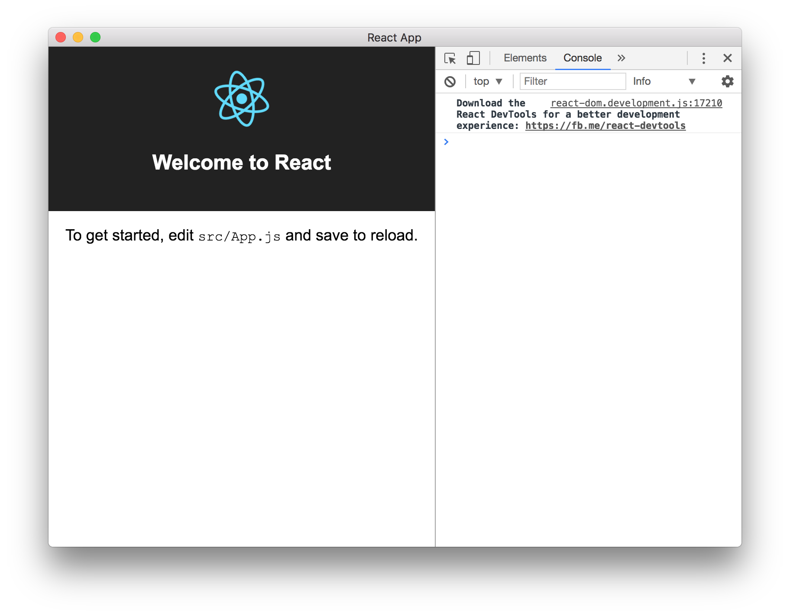

# Cra-electron

[](https://greenkeeper.io/)

## Step

```cmd
$ create-react-app cra-electron
$ yarn add \
  electron \
  electron-builder \
  concurrently \
  wait-on \
  --dev
```

- [Create-react-app#1718](https://github.com/facebookincubator/create-react-app/pull/1718)
- [How to build an Electron app using create-react-app. No webpack configuration or “ejecting” necessary.](https://medium.freecodecamp.org/building-an-electron-application-with-create-react-app-97945861647c)
- [Electron-builder Quick Setup Guide](https://github.com/electron-userland/electron-builder#quick-setup-guide)

```cmd
$ npm start # development
$ npm run build
```

## Screenshot

